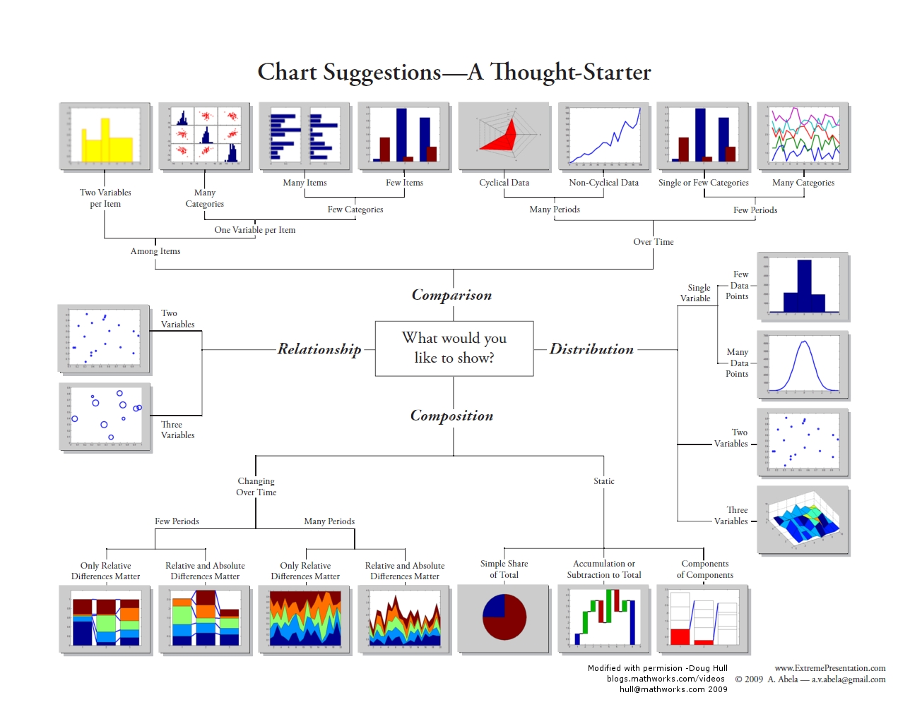

# Bookmark for developer role

## Data Exploration

* Variable Identification - Defined all data type.
* Univariate Analysis - Find distribution of any features.
* Bi-variate Analysis - Find relationship of any couple features.
* Handle missing variable.
* Handle outlier data.
* Feature Engineering / Data Transform
* Data Clean

### Reference

* [Comprehensive Guide to Data Exploration](https://www.analyticsvidhya.com/blog/2016/01/guide-data-exploration/)

## Data Visualization

[Reference Image](https://apandre.wordpress.com/dataviews/choiceofchart/)

* [Data Visualization Catalogs](https://datavizcatalogue.com/index.html)

## Machine Learning / Deep Learning / AI

* [Comprehensive Lists for Machine Learning](https://github.com/TarrySingh/Artificial-Intelligence-Deep-Learning-Machine-Learning-Tutorials)

## Educational Data Mining

* [EDM Conference](http://educationaldatamining.org/)
* [The case of social-emotional learning](https://slejournal.springeropen.com/articles/10.1186/s40561-016-0040-4)

## Math / Stat with huge data processing

* [Moving Average](https://en.wikipedia.org/wiki/Moving_average) - Average / Mean (Cumulative Mean)

## Text Based Tutorial (Blog post / Github)

[WindML](http://www.wildml.com/) - Blog post about Machine Learning
[Analytics Vidhya](https://www.analyticsvidhya.com/) - Blog post about Analytic
[Apache MXNet - Gluon](http://gluon.mxnet.io/) - Machine Learning, Deep Learning concept and tutorial with Apache MXNet.